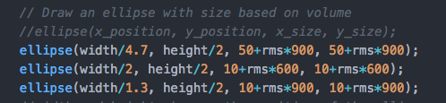

Link:  https://rawgit.com/sisselrll/Mini-Ex/master/mini_ex1/empty-example/index.html

My program: 

My program consists of three circles that all change in size according to the volume of the amplitude of the song. So as the song builds up and the volume increases the expression of the circles expanding becomes more aggressive.

The process: 

For inspiration I went to P5.js Examples and found a default code for a single circle based on the volume of a default song.  First of all I wanted the program to include my own choice of song. This let me to working with the song syntax and the preload song function.  From this I learned the importance of being entirely sure of the path leading back to the folder and the file. I had several attempts trying to get the syntax working, but because I had the song in the wrong folder it didn't  work. Furthermore the preload function has to be placed before setup function in the code, otherwise the song is not loaded before the start of the event (the same counts for an image). 
After changing the default song, I wanted to impact the design of the default canvas and circle. I did this by working with the function draw and the different syntax's background, fill stroke, and stroke weight. 
The most challenging part for me was to understand how the size of the ellipse could change according to the volume of the song. For an ellipse there are four parameters that defines its position and size. These are the x, y, h and w.  In this case the height and width depended on the volume of the sound which here is measured in the average value of the amplitude. This value is called a root mean square (rms). That allowed me to set the minimum value for how small the circle could be and the highest value for how big the circle could be, all in relation to the rms value. The circle in the middle has a smaller range in size, because I decided to give it a lower value in width and height.

Reflection: 

To relate the practice of coding to the practice of reading and writing I see similar points in how you have certain rules for structuring both sentences and code.  In a sentence you would most likely need to have a verb and subject. When coding in p5.js you need to have a setup function and a draw function and the order of the functions also matters in the execution of the program.  When writing a text there also are certain rules of how to build up your language grammatically correct. The difference though is to what extend it is possible to "bend" the rules in writing and reading contra coding. In reading a text you would often still be able to understand the context and the meaning even though a comma or a dot is missing, or if you made some spelling mistakes. When coding, you couldn't execute the program and get to see a result if you simply forgot a semicolon or spelled a function or variable wrong. 

The potential and possibility of coding practice:
