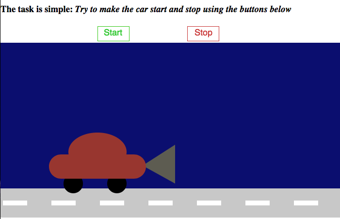

Link: https://rawgit.com/sisselrll/Mini-Ex/master/mini_ex2/empty-example/index.html

### My program

My program is about a car that you can have moving forward and stop again by clicking on a stop and a start button. The car and the road is build of simple shapes such as rectangles, ellipses and triangles. All of the shapes are made in the function draw, but I seperated the shapes that form the car from the rest of the shapes, by using the functions push() and pop(). This allows me to move the shapes of the car from a common starting point of 0, so that they move as one unit. Furthermore I used the function translate() to make the shapes of the car communicate with the variable x, so I could make it move following the x axis.  
For me, this process was really educational according to how to work with conditional statements (Frustrating as well, but a great amount of happiness when it worked). I got to communicate between variables and if statements, and thereby make the car start or stop due to two different statements. First I had to make the browser check if the cursor was inside the box of the button and, then I had to assign a value to each box so I could register a mouseclick. Then I assigned a value to each of the boxes with a variable. Basically the car is told to move if the t variable is over 0, which you will get if you click the "stop" button. The car is told to stop when the t variable again is 0, which you will get if you click the "start" button. 

### The notion of fun 

I wouldn't say that my program is in the category of "Haha" fun, it would actually rather irritate or frustrate the user. My idea behind this is to break with the logical perception of how to interact with a program. This contradicts the regular ideals of efficiency in computating and hereby brings some paradoxicality to the work. There is no purpose of the program rather than messing up with our logical perception of both colors and the words "Stop" and "Start". 

