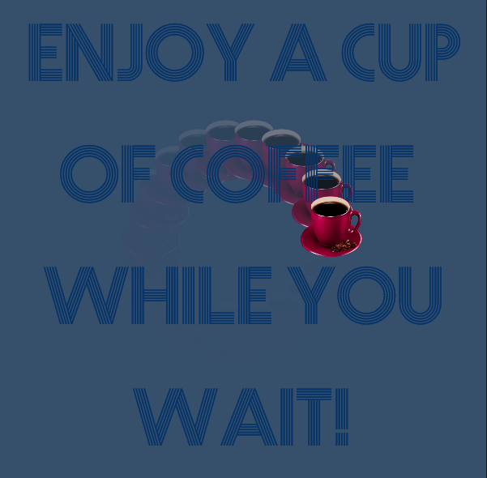

Link: https://rawgit.com/sisselrll/Mini-Ex/master/mini_ex3/empty-example/index.html 

### My prgram 

My throbber consists of a coffee cup moving around in a circle in a continuos tempo. Behind the throbber the text "Enjoy a cup of coffe while you wait!" fills up most of the canvas size. 
Technically the design of the throbber is based on a time-related function in the form of a drawThrobber function, that rotates the coffee cup in the 360 degree circle. The default rotation of the image of the cup had the rotating around itselt (So that the coffe would spill out the cup). To prevent that, I had to both rotate the radians of the circle variable positively and negatively. In that way the coffee cup is always 'standing'. 
The pattern of the cup, that actucally is the effect that makes us percieve the throbber as a circle, is made of a partly transparent rectangle behind the throbber that keeps on drawing itself. 

### How to think upon the throbber icon 

Conceptually my throbber expresses the fact that the buffering time is not always a punishment. As Jason Farman argues it can be seen as a gift to have the time to recieve and interpret a message since this is also part of the overall content. A coffee break is often seen as something positive. If you transfer the concept of enjoying waiting time or 'wasted time' to the spinning throbber that annoys most people, we would have a totally different view upon waiting online adn maybe offline as well. It would mean that instead of anxiety or frustrations, you would appreciate the time you had to think about your expectations of what to come and interpret what where you came from/ what you just experienced. 
If you think about a throbber hidding something from you (Keeps you on hold for what you want to see), you can say that the concept of enjoying waiting, adds a new perspetive to it - Insteand of hidding something, it shows/ leads you to something. It leads you to your own reflections. 
