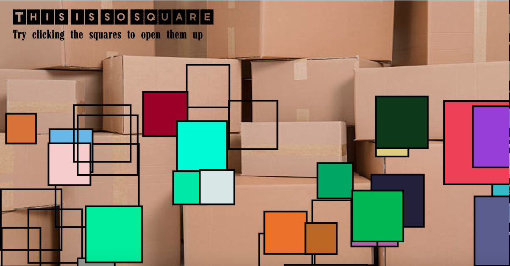

Link: https://rawgit.com/sisselrll/Mini-Ex/master/mini_ex5/empty-example/index.html 

### My Program/ Game 
The game is rather simple to play - As the time goes, more and more squares will display on the canvas. Your job then is to click the squares to make them see-through. The code behind the game is more complex though, at least compared to what I have been doing before *(I must admit I did get some help as well).* The program consists of a class I called "firkant", which is where I define the proporties of my objects. The objects are the squares that gradually is displayed on the canvas. They all belong to the class since they all are defined by  the proporties I gave the class (color, size, x and y position). To actually draw the squares I have a function add, which is set to create a new square randomly from the four proporties of the class everytime 'add()' is called. 
The complecity for me in this program, was to allow one to click on a square and then the color for that clicked square would disappear. First I tried to just make the transparacy of the square's color change, but since the square was allready drawn, the new transparent square on top of the other, didn't make any sense - You couldnøt see the result. I managed to overcome this challenge by drawing all of the squares again after clicking the mouse. The code checks which squares has been clicked and draws them with noFill() and the squares that haven't yet been clicked will be drawn still with the color assigned to them with fill(this.getcolor).

### The Digital Culture Context 

