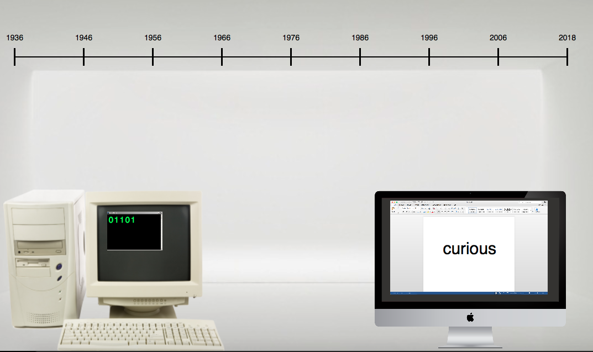

# Mini exercise 7

Link  https://rawgit.com/sisselrll/Mini-Ex/master/mini_ex7/empty-example/index.html

### Collaborated with: 
Ester Aagaard (https://github.com/estermarieAA)

### The program
The program consists of  two computers, speaking two different languages. The older computer speaks through binary code and the newer through spoken language. In the two different languages, they are both reading the first verse of the poem "Raven" by Edgar Allan Poe. Each time the binary code has typed the combination of 0's and 1's corresponding to a word in the poem, the actual word is shown on the other computer. This procedure continues throughout the first verse of the poem until the last word - then the program stops. 
(Very late in the process we figured out that the translation from binary code to words was not entirely correct. We are aware of the fact that we only show one letter in binary code every time we show one word. This is a tecnicallity and we choose to leave it, since it does not mess with our overall idea of the program). 
Furthermore the program shows a roughly sketched timeline of the development of the computer - From the year Alan Turing invented the computer to now. This is not to appear informative in any way, but rather to illustrate how it has become easier to speak the computational language as the computer has been developed further. When it was first invented you was considered a professional in the field if you could interact with computers. Now everyone can use "normal" languages to communicate with computers, and these interactions are now an everyday thing for non-professionals as well. 

### The program as an e-lit work

According to the relation between code and language, the program provides a view upon the contrasts and similarities between the programming language and the spoken language. The two computers and languages in coherence with the timeline illustrates how it over time, has become more accessible to understand and engage with the computational language. The programming language is of course most essential to having the program run and function, but without the "translation" into a understandable way for every human, the development of further computational stuff would be highly restricted, because for whom would you develop? The contrasts betwwen the binary code and the spoken language lies within the different platforms they serve on and in their different way of expressing meaning. The binary code is written in a backend interface in the terminal  with 0's and 1's for the computer to read and the translation into the spoken language is written in a fronted interface in the microsoft office word with words to understand in whatever spoken language you speak. The similarities lies within the fact that the two ways of expressing themselves is actually communicating the same. 
You are actually bridging two worlds with a translation enabling direct communication between computers and every human. To use a reference from Geoff Cox, you can say that the program is giving a voice those without a voice (p. 29). The old computer wouldn't have a voice without the new computer, at least not one for everyone to unerstand. 

