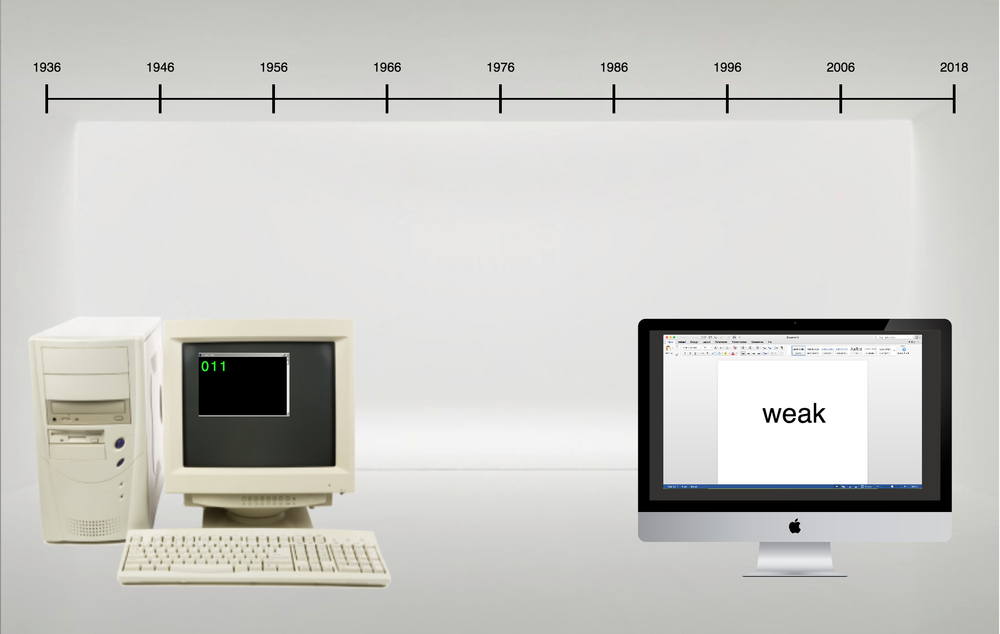
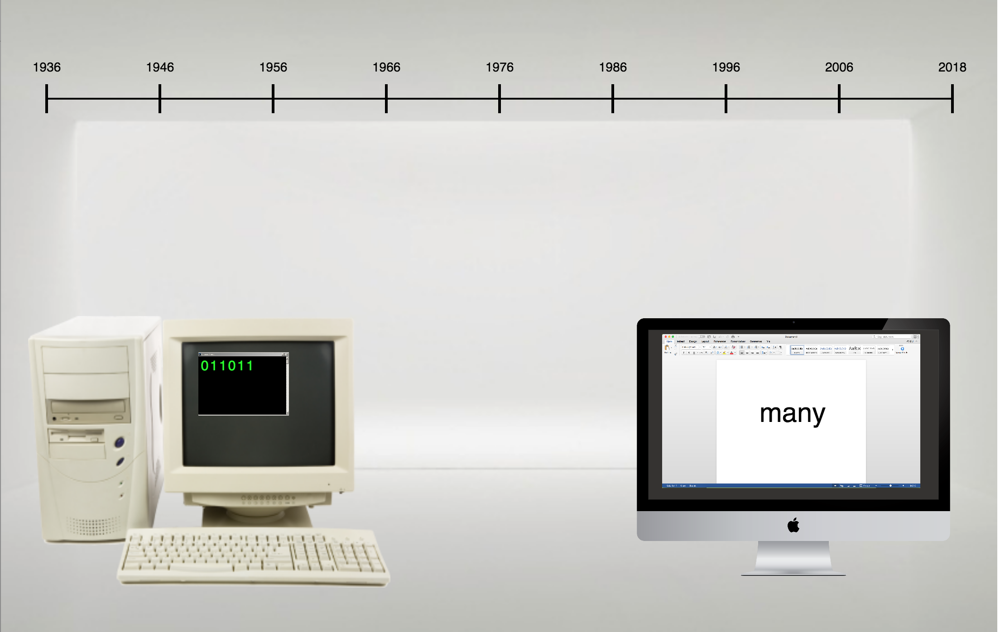

# Mini exercise 7

### E-lit

##### link:
https://estermarieaa.github.io/Mini-exercises/mini_ex07

##### Collaborated with: 
Sissel Raahede (https://github.com/sisselrll)

#### Analysis of E-lit work 

The aesthetic aspects of our E-litterature work:

Our starting point was a discussion about the processes that are hidden from a human perspective, when a computer processes a code f.ex. written in javascript. A high level programming language can be changed into a machine language if put through a interpreter, and this happens continually when we run code on our computers. 
The things we perceive on our computer screen is made to function in our 
We have a particular production of meaning which we use to understand the world. To understand what happens on the computer and what we perceive on our screen, programmers often tend to program something that relates to our shared understanding of how the world works. 
“As software becomes ubiquitous it becomes ever more connected to external processes and programs no longer encode pure logic but human social behaviour too. Such approaches recognize that systems are embedded in larger language systems where meanings are produced through social practices. In other words, computer programs have bodies in the sense that other materialities and meanings are deeply interwoven, and there necessarily exist as part of wider social relations” (p.27)
In relation to this we created our idea of our program. To make visible some of the different things that involve both coding and language when a high level program is executed on a computer, which interprets the code down to binary code and in the end into different electrical signals. The first thing we are presented with is the natural language. This we understand because we have a common understanding of what the world is, and how it works. The second thing we are presented with is the binary code, which is also a language, but not one many understands. This is because it is not constructed of our meaning production. It is instead constructed of a particular maybe mathematic meaning production, but one that many people are not a part of. In the end the materialities of the code becomes tangible when the code is translated into electrical signals in the different components of the computer. 

"to give voice to those without a voice"(p.29)

In this way voice is given to materialities without a voice. A electrical signal, or several, becomes a binary code, that becomes a word that is widely understood through a shared meaning perspective. In this way we show a clear connection between code and language. 

Our program tend to create attention about the ways in which code (and the computer) has developed through time, and whether or not this change has made it easier for a larger amount of people to understand code, when it is represented as natural language or a shared meaning perspective. Or if it instead has distanced humans from trying to understand code, because the path from electric signals to what is executed in the end, has become more difficult and involves more and more interpretators, and therefore require that the user is able to speak several languages to understand what happens. 

