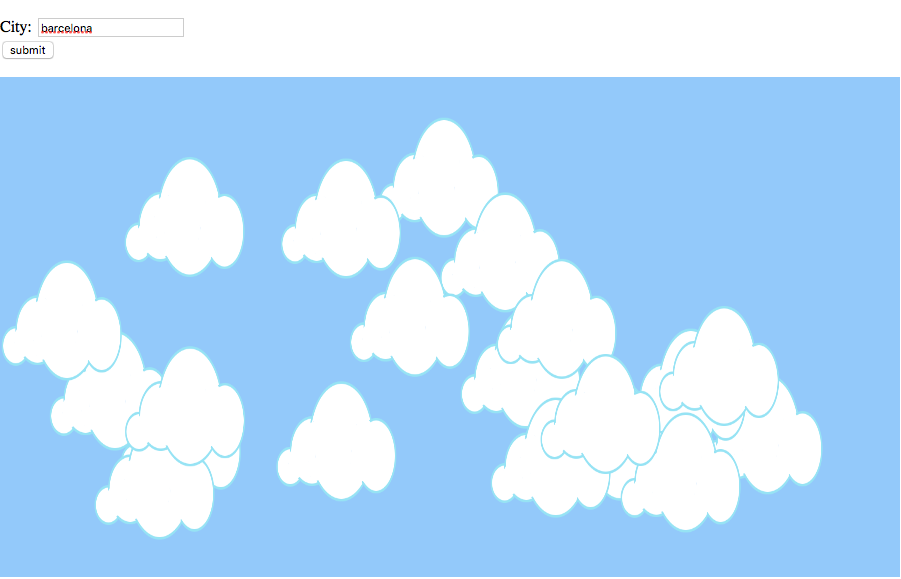

##### How cloudy? 

Link  https://rawgit.com/sisselrll/Mini-Ex/master/mini_ex8/empty-example/index.html

Since we had some struggle with having the program work as a link, this is a proof that is has been working: 
https://www.youtube.com/watch?v=dmm5WuZKEUc&feature=youtu.be 

The program is made in collaboration with Nina Borgbjerg https://github.com/nborgbjerg 

### The program

For this program we have used the open weahter map API to make it possible to search for a city and then see how many clouds and how much wind there currently is. This data is then visualized in the form of clouds. The amount of clouds on the canvas illustrates the persentage amount of the clouds in the city. How the clouds move illustrates the amount of wind - If the clouds moves slowly, there isn't that much wind and if the move fastly, the amount of wind is bigger. You are not shown any numbers for you to relate to the numbers they for example tell in the weather forecast, you are only to interpret the visualization we are giving you.
To be honest this API wasn't our first choice, neither second or third.. We highly overrated our skills and luck in working with API's for the first time, so we took a frustrating and timeconsuming journy, trying out some different API's with no success. (At the moment I am not the biggest fan of API's). Okay but back to why we ended up with this API. We had an interest in being able to make use of data visualization in the matter of presenting data in a different way than just with numbers. Furthermore we would like to work with an API that constantly (or quiet often) had updates in its data. Lastly we were so sick of failure that we where happy to be able to follow along the shiffman tutorial, which uses the same API :) 

### The process 
I think that the data our API provides, is easy understandable. You are told how the data is measured for example that the unit for the wind data is meter/sec and for the amount of clouds it is is shown in persentage. This API interface gives you an overview of which parameters to choose from and how you can structure your request in your code. 

### Further investigation 

I see a lot of opportunities in working with API's, but after this exercise I also see it being a lot more complicated for me to understand on a technical basis, than first thought. I would like to become better and faster at figuring out how affordable and transparent the different API's are to work with when being a beginner. 

